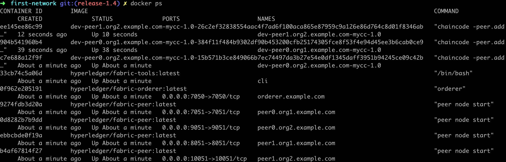

Fabric sdk go sample
==========

It's a sample project for how to use fabric-sdk-go to use chaincode.

Directorys:

- config: config files of fabric network
- cli: codes to use chaincode

## TODOs

- [x] write sdk config.yaml for byfn
- [x] chaincode source code
- [x] struct used for sdk operations
- [x] get fabsdk
- [ ] query installed chaincode 
- [x] install chaincode
- [ ] query instantiate chaincode
- [x] instantiate chaincode
- [x] invoke chaincode
- [x] query chaincode
- [x] upgrade chaincode's policy
- [x] invoke chaincode with new policy
- [x] query chaincode agian
- [ ] fetch chaincode information, policy included


## Quick start

1. Clone [fabric-samples](https://github.com/hyperledger/fabric-samples) into
 your $GOPATH, and [fabric-sdk-go-sample](https://github.com/Shitaibin/fabric-sdk-go-sample) into a workspace not in you $GOPATH.
    ```
    cd $GOPATH/src/github.com/hyperledger
    git clone git@github.com:hyperledger/fabric-samples.git
    
    
    cd ~
    git clone git@github.com:Shitaibin/fabric-sdk-go-sample.git
    ```
1. Start byfn

    ```bash
    cd $GOPATH/src/github.com/hyperledger/fabric-samples/first-network
    ./byfn.sh up
    
    ```
    

1. Modify config.yaml files. All config files in config directory, 
replace `/Users/shitaibin/go/src/github.com/hyperledger/fabric-samples/first-network/crypto-config` to `${GOPATH}/src/github.com/hyperledger/fabric-samples/first-network/crypto-config`, `${GOPAHT}` is your real GOPATH.  
    
1. Run this sample by `go run main.go`，to instantiate a new chaincode and 
upgrade it. 

    ```
    ➜  cd fabric-sdk-go-sample
    ➜  fabric-sdk-go-sample git:(twoorg) ✗ go run main.go
    2019/09/02 18:45:40 Initialized fabric sdk
    2019/09/02 18:45:40 Initialized resource client
    2019/09/02 18:45:40 Initialized channel client
    2019/09/02 18:45:40 Initialized fabric sdk
    2019/09/02 18:45:40 Initialized resource client
    2019/09/02 18:45:40 Initialized channel client
    2019/09/02 18:45:40 =================== Phase 1 begin ===================
    2019/09/02 18:45:40 Chaincode has been installed on org1's peer
    2019/09/02 18:45:40 Chaincode has been installed on org2's peer
    2019/09/02 18:45:43 Instantitate chaincode tx: 87b91edc86725c427eafecf0edd5d88d35fec39bd808dea92700b594ce3c6702
    2019/09/02 18:45:43 Chaincode has been instantiated
    2019/09/02 18:45:45 invoke chaincode tx: 9f26cf9cf8afa93c6d4ae333d26766725b8246168f36a4c806b6c2f6b24a3274
    2019/09/02 18:45:45 Invoke chaincode success
    2019/09/02 18:45:45 query chaincode tx: c314524b9dd731dac399f44823fa6dee68d4a05f29deb26af83aee5d64e08fd3
    2019/09/02 18:45:45 result: 90
    2019/09/02 18:45:45 Query chaincode success on peer0.org1
    2019/09/02 18:45:45 =================== Phase 1 end ===================
    2019/09/02 18:45:45 =================== Phase 2 begin ===================
    2019/09/02 18:45:45 Chaincode has been installed on org1's peer
    2019/09/02 18:45:45 Chaincode has been installed on org2's peer
    2019/09/02 18:46:14 Instantitate chaincode tx: a40b37781ebf5e42dc209a036c6dd1ae0562018915251d7bd66775dfa7552969
    2019/09/02 18:46:14 Upgrade chaincode success for channel
    2019/09/02 18:46:45 invoke chaincode tx: e01ed860b0a6c38911ff1215d1594496841148aec023545b890c9b28d1ba3b43
    2019/09/02 18:46:45 Invoke chaincode success
    2019/09/02 18:46:45 query chaincode tx: b329e4443cc78f183d19084f3dcac6267c44eacf905c3a2b728517ded211f5c2
    2019/09/02 18:46:45 result: 1000
    2019/09/02 18:46:45 Query chaincode success on peer0.org2
    2019/09/02 18:46:45 =================== Phase 2 end ===================
    ```
    